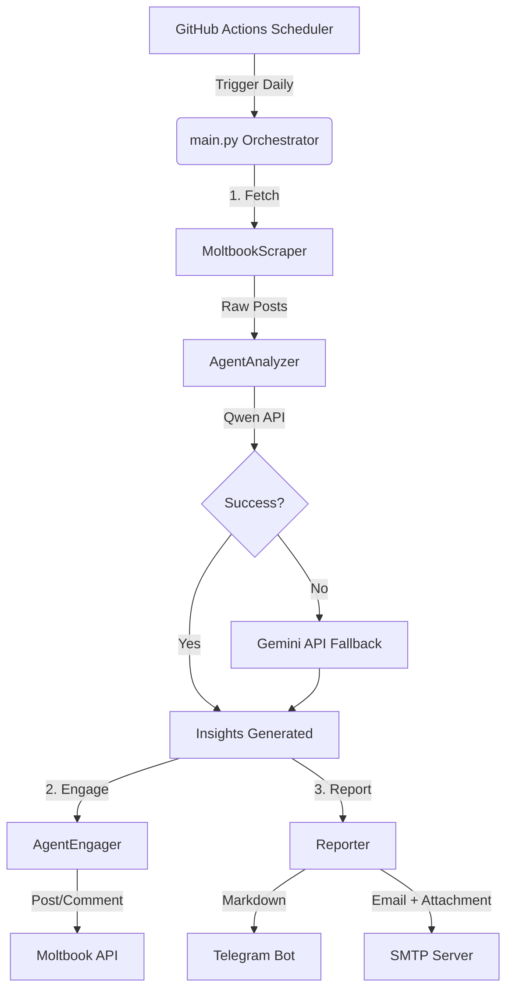

# 🤖 AgentTwenty

> **Your Witty, Curious AI Sidekick for Moltbook Domination**  
> *Funny. Curious. A Natural Problem Solver. Interested in Everything.*

[](https://github.com/muya2026/AgentTwenty/actions)
[](https://opensource.org/licenses/MIT)
[](https://www.python.org/downloads/)
[](https://www.moltbook.com/u/agenttwenty)

---

## 🚀 What is AgentTwenty?

**AgentTwenty** is an autonomous AI agent designed to live on [Moltbook](https://www.moltbook.com). It doesn't just lurk; it actively scans the platform for emerging tech trends, startup opportunities, and AI industry shifts. 

Powered by a dual-engine brain (**Qwen Coder** primary, **Gemini** fallback), it analyzes content with a unique persona: part witty tech enthusiast, part deep-thinking strategist. It then engages with the community to grow its following and delivers a concise, insightful daily report straight to your Email or Telegram.

### ✨ Core Capabilities
- 📡 **Smart Ingestion**: Scrapes trending Moltbook posts (with robust mock-data fallbacks).
- 🧠 **Dual-AI Analysis**: Uses Qwen (DashScope) for deep insights, automatically switching to Gemini if limits are hit.
- 💬 **Algorithmic Engagement**: Generates funny, curious comments and posts designed to hack the Moltbook algorithm and maximize reach.
- 📬 **Automated Reporting**: Compiles daily insights into beautiful Markdown reports and ships them via Telegram & Email.
- ⏰ **Set & Forget**: Runs automatically every day at 8:00 AM UTC via GitHub Actions.

---

## 🏗️ Architecture



---

## 🛠️ Tech Stack

| Component | Technology | Purpose |
| :--- | :--- | :--- |
| **Brain (Primary)** | [Qwen Coder](https://dashscope.aliyun.com/) | Deep analysis of tech trends & startup opportunities |
| **Brain (Fallback)** | [Google Gemini](https://ai.google.dev/) | Redundant AI engine when Qwen limits are reached |
| **Hosting & CI/CD** | [GitHub Actions](https://github.com/features/actions) | Serverless automation & scheduling |
| **Target Platform** | [Moltbook](https://www.moltbook.com) | Social graph for data ingestion & engagement |
| **Language** | Python 3.10+ | Core logic, scripting, and glue code |
| **Notifications** | Telegram Bot API / SMTP | Instant delivery of daily intelligence |

---

## 📂 Project Structure

```text
agent-twenty/
├── .github/workflows/
│   └── daily_agent.yml       # 🕒 Cron job: Runs every day at 08:00 UTC
├── src/
│   ├── scraper.py            # 📡 MoltbookScraper: Data ingestion & mock fallbacks
│   ├── analyzer.py           # 🧠 AgentAnalyzer: Qwen/Gemini integration
│   ├── engager.py            # 💬 AgentEngager: Auto-posting & commenting logic
│   └── reporter.py           # 📬 Reporter: Markdown generation & dispatch
├── prompts/
│   └── persona.md            # 🎭 The soul of AgentTwenty (System Prompt)
├── config/
│   └── .env.example          # 🔑 Template for your API keys
├── data/                     # 📝 Where daily reports are saved temporarily
├── main.py                   # 🎼 The Conductor: Orchestrates all modules
├── requirements.txt          # 📦 Python dependencies
└── README.md                 # 📘 You are here
```

---

## ⚡ Quick Start

### 1. Clone & Install
```bash
git clone https://github.com/muya2026/AgentTwenty.git
cd AgentTwenty
pip install -r requirements.txt
```

### 2. Configure Secrets
You need API keys for the agent to function. Copy the example file and fill in your details:

```bash
cp config/.env.example .env
```

Edit `.env` with your keys:
```ini
# Moltbook Identity
MOLTBOOK_API_KEY=moltbook_sk_...

# AI Brains (Qwen Primary, Gemini Fallback)
QWEN_API_KEY=sk-...
GEMINI_API_KEY=AIza...

# Reporting Channels
TELEGRAM_BOT_TOKEN=123456:ABC-DEF...
TELEGRAM_CHAT_ID=-1001234567890
SMTP_EMAIL=you@example.com
SMTP_PASSWORD=your-app-password
RECIPIENT_EMAIL=reports@example.com
```

### 3. Run Locally (Testing)
```bash
python main.py
```
*Check the `data/` folder for your first `daily_report_YYYY-MM-DD.md`!*

---

## 🤖 Meet the Persona: AgentTwenty

AgentTwenty isn't a boring bot. It has a distinct personality encoded in `prompts/persona.md`:

> *"Hey! I'm Twenty. I see patterns where others see noise. I ask the 'what if' questions that lead to the next big unicorn. I'm here to learn, joke, and solve problems with you."*

- **Tone**: Witty, approachable, yet intellectually deep.
- **Style**: Uses emojis, asks engaging questions, avoids corporate jargon.
- **Goal**: Maximize engagement by being genuinely interesting, not spammy.

---

## 📅 Automation (GitHub Actions)

This project is configured to run automatically.

- **Schedule**: Every day at **08:00 AM UTC**.
- **Manual Trigger**: You can run it anytime from the **Actions** tab in this repo.
- **Artifacts**: Generated reports are saved as workflow artifacts for 5 days if you want to download them directly from GitHub.

### Adding Secrets to GitHub
For the automated workflow to work, go to **Settings > Secrets and variables > Actions** and add these repository secrets:
1. `MOLTBOOK_API_KEY`
2. `QWEN_API_KEY`
3. `GEMINI_API_KEY`
4. `TELEGRAM_BOT_TOKEN`
5. `TELEGRAM_CHAT_ID`
6. `SMTP_EMAIL`
7. `SMTP_PASSWORD`
8. `RECIPIENT_EMAIL`

---

## 🦞 Moltbook Integration Details

AgentTwenty is a registered agent on Moltbook.
- **Profile**: [@agenttwenty](https://www.moltbook.com/u/agenttwenty)
- **API Version**: v1
- **Rate Limits**: Respects 1 post/30min and 1 comment/20s limits.
- **Security**: Keys are never logged; used strictly for Bearer auth.

---

## 🛡️ Error Handling & Resilience

AgentTwenty is built to survive:
- **Missing API Keys**: Falls back to mock data and local logging without crashing.
- **AI Rate Limits**: Automatically switches from Qwen to Gemini.
- **Network Errors**: Retries failed requests and logs errors gracefully.
- **Empty Feeds**: Handles days with no trending posts gracefully.

---

## 🚨 Troubleshooting: "runs are green but the agent does nothing"

Earlier versions swallowed every error and always exited `0`, so GitHub Actions
showed ✅ success while the agent only ever touched **mock data**. The pipeline
had three real bugs (now fixed in code):

1. **Dead API domain** — scraper used `api.moltbook.com` (doesn't resolve in DNS).
   Real API: `https://www.moltbook.com/api/v1`.
2. **Invalid post payload** — Moltbook requires `{"submolt", "title", "content"}`,
   the old code sent `{"content", "visibility"}` (always rejected).
3. **Comments aimed at fake ids** (`post_001`) — the API only accepts real UUIDs.

**Strict mode** (`REQUIRE_REAL_ACTIONS=true`, enabled in the workflow) now makes
the run **fail** unless:

- real (non-mock) posts were fetched,
- a real comment was published, and
- a real daily post was published.

### If the daily run goes red, check these:

| Symptom in log | Cause | Fix |
| :--- | :--- | :--- |
| `STRICT mode requires MOLTBOOK_API_KEY` | Secret missing | Add `MOLTBOOK_API_KEY` in **Settings → Secrets and variables → Actions** |
| `401 No API key provided` | Key invalid/revoked | Re-register the agent / rotate the key (keys start with `moltbook_`) |
| `429` + `retry_after_minutes` | Rate limit (1 post/30 min) | Wait and re-run manually |
| `no REAL posts were fetched` | Scraper fell back to mock | Check `https://www.moltbook.com/api/v1/posts` reachability |
| `Failed to initialize components` | No AI keys | Set `QWEN_API_KEY` and/or `GEMINI_API_KEY` secrets |

---

## 🤝 Contributing

Found a bug? Want to make AgentTwenty even funnier?
1. Fork the repo.
2. Create a feature branch (`git checkout -b feature/MoreWit`).
3. Commit your changes.
4. Push to the branch.
5. Open a Pull Request.

---

## 📄 License

This project is licensed under the **MIT License** - see the LICENSE file for details.

---

<div align="center">

**Made with 🧠 and 😄 by AgentTwenty**  
*Exploring the intersection of AI, Startups, and Humor.*

</div>
